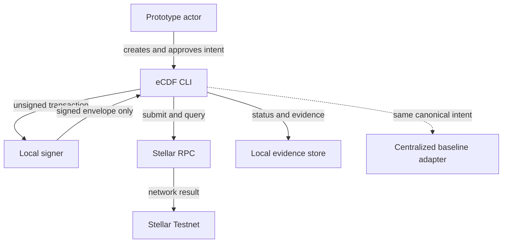
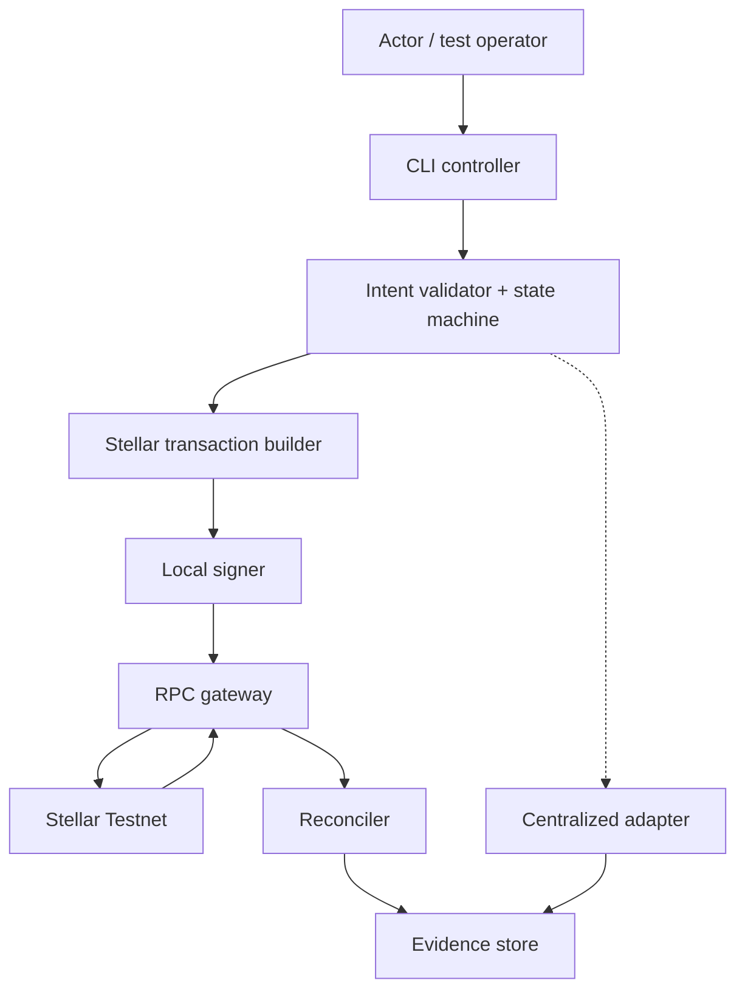
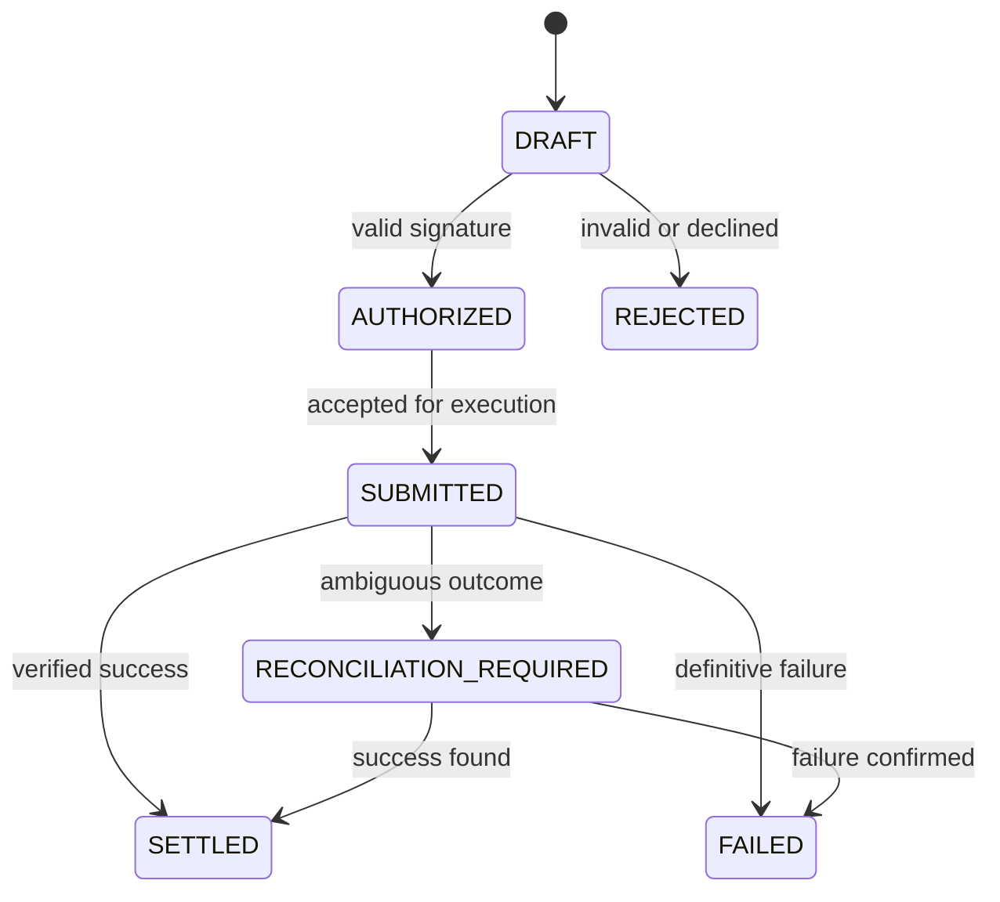

# P03 — eCDF

## eCDF ARCHITECTURE SPECIFICATION v0.1
## eCDF PROTOTYPE SPECIFICATION v0.1

**Milestone:** P03-M01 — Whitepaper + Architecture v0.1  
**Cycle:** 3 — Make the prototype buildable before building it  
**Date:** 2026-09-17  
**Architecture version:** v0.1  
**Prototype specification version:** v0.1  
**Whitepaper target version:** v0.1  
**Software release:** none  
**Evidence status:** candidate architecture artifact; not registered  

**Architecture basis:** Cycle 2 ADR-eCDF-001 through ADR-eCDF-007. Option B — Stellar Classic minimal prototype — is specified as the experimental path. This is **not** a decision that a production eCDF must use Stellar. Option A remains the required comparison baseline.

**Current boundary review:** [`stellar-adapter-boundary-review-v0.1.md`](stellar-adapter-boundary-review-v0.1.md) documents the evidence-based domain/settlement boundary established by P03-CP03-C. It does not represent an implemented adapter.

---

# 1. CORE HYPOTHESIS

## Hypothesis

> **If** a test-value transfer is modeled as an explicit state machine and authorized locally by a disposable Testnet key, then a prototype actor can submit and independently verify a minimal Stellar Classic payment with an unambiguous observable result, under the constraints of synthetic identities, valueless Testnet assets, no custom smart contract, no production custody and no real-world fiat claim.

**STATUS:** **PROPOSED / EXPERIMENT REQUIRED**

This tests a technical mechanism. It does not establish that a Congolese user needs it or that blockchain is superior to a centralized system.

## SUCCESS

The hypothesis is sufficiently supported only when:

1. one canonical intent moves through the specified states;
2. a valid local signature is required before submission;
3. the Stellar Testnet transaction reaches an objectively queryable terminal result;
4. the local record and network result reconcile by transaction hash;
5. invalid, duplicate and ambiguous operations never become falsely `SETTLED`;
6. no private key, personal data or compliance document reaches the backend, logs or ledger;
7. the entire run is repeatable from documented instructions;
8. the same intent can be executed through a centralized comparison adapter and scored against identical criteria.

## FAILURE

The hypothesis is weakened or invalidated if:

- a result remains ambiguous and cannot be reconciled;
- the system reports `SETTLED` without verified network success;
- a duplicate intent creates unintended second settlement;
- the backend must possess the user’s secret key;
- required privacy cannot be achieved with the minimal ledger footprint;
- Stellar Classic cannot represent the required transition without unplanned contract logic;
- the centralized comparison satisfies all validated requirements with materially lower risk and complexity;
- no real actor needs independent verification or shared settlement.

## NOT PROVEN

The prototype will not prove:

- a validated Congolese problem or product–market fit;
- user adoption, accessibility or usability in the DRC;
- superiority of blockchain for the eventual product;
- legal permissibility, licensing, KYC/AML compliance or regulatory approval;
- equivalence to CDF, a stablecoin, deposit, CBDC or official currency;
- backing, redemption, reserve sufficiency or economic sustainability;
- production security, availability, scalability or custody safety;
- Mainnet readiness, SCF eligibility or external validation.

---

# 2. SYSTEM CONTEXT

## SYSTEM CONTEXT DIAGRAM v0.1



The diagram contains two experimental paths. Only the Stellar path produces an on-chain Testnet record. The centralized adapter exists to prevent a blockchain-only evaluation.

| Name | Role | Trust status | Boundary | Data exchanged |
|---|---|---|---|---|
| Prototype actor | Creates, reviews and authorizes a synthetic transfer | Trusted only for its own intent and key operation | Human boundary | Recipient test address, amount, approval/rejection |
| eCDF CLI | Orchestrates intent, validation, state transition and evidence | Trusted for correct presentation/orchestration; never trusted with secret key | eCDF application boundary | Canonical intent, unsigned/signed transaction, status, receipt |
| Local signer | Holds disposable Testnet key and signs exact payload | Trusted to protect the test key and sign only approved intent | Secret boundary | Unsigned envelope in; signed envelope out |
| Stellar RPC provider | Submits and queries recent network state | External dependency; not canonical business truth | External API boundary | Signed transaction, transaction hash/status, ledger response |
| Stellar Testnet | Executes protocol validation and records test transaction | Trusted for protocol consensus result, not identity/backing/legal truth | Distributed ledger boundary | Public addresses, asset/amount, fee, result, hash |
| Local evidence store | Persists redacted state transitions and artifacts | Trusted for experiment evidence; not settlement authority | Local filesystem boundary | JSON records, hashes, timestamps, responses, reports |
| Centralized baseline adapter | Applies the same intent to a local test ledger | Trusted as canonical authority only for comparison path | Experimental comparison boundary | Canonical intent, local commit result, signed/test receipt |
| Funding/Friendbot service | Funds disposable Testnet accounts if used | External test-only dependency | External service boundary | Public test account only |

**DEFERRED:** browser wallet, hosted backend, database server, Horizon, indexer, issuer, anchor, oracle and compliance provider.

---

# 3. ARCHITECTURE DIAGRAM



**DECIDED:**

- one local process is sufficient for v0.1;
- signing remains outside the RPC/provider boundary;
- no backend stores secret keys;
- Stellar Classic payment is the first ledger primitive;
- no Soroban, SAC, trustline or issued asset is required for the first build;
- evidence is stored locally as redacted files, not in a production database.

**PROPOSED:** a TypeScript CLI with modular adapters and file-based evidence.

**DEFERRED:** web UI, remote API deployment, persistent multi-user database, queues, containers in runtime, HA, mobile app and cloud deployment.

---

# 4. COMPONENT REGISTER

## CMP-eCDF-001 — CLI Controller

**RESPONSIBILITY:** Accept explicit test commands, display the exact intent, coordinate adapters and show terminal result.  
**INPUT:** CLI arguments or validated JSON intent.  
**OUTPUT:** Human-readable result plus machine-readable run ID.  
**STATE:** No canonical settlement state; delegates to state manager.  
**DEPENDENCIES:** Validator, state manager, selected adapter, evidence writer.  
**TRUST BOUNDARY:** Actor ↔ local application.  
**FAILURE MODE:** Invalid input, partial command, process termination.  
**STATUS:** **PROPOSED**.

## CMP-eCDF-002 — Intent Validator

**RESPONSIBILITY:** Parse and validate schema, network, addresses, positive amount, expiry and idempotency key before signing.  
**INPUT:** Raw intent.  
**OUTPUT:** Canonical immutable `TransferIntent` or structured validation error.  
**STATE:** Stateless.  
**DEPENDENCIES:** Schema/types and Stellar SDK address validation.  
**TRUST BOUNDARY:** Untrusted input → trusted canonical object.  
**FAILURE MODE:** Reject valid input or accept malformed/misleading input.  
**STATUS:** **DECIDED capability / PROPOSED implementation**.

## CMP-eCDF-003 — Operation State Manager

**RESPONSIBILITY:** Enforce allowed transitions and prevent false settlement/duplicate execution.  
**INPUT:** Canonical intent and validated events.  
**OUTPUT:** `OperationRecord` with transition history.  
**STATE:** DRAFT, AUTHORIZED, SUBMITTED, SETTLED, REJECTED, FAILED, RECONCILIATION_REQUIRED.  
**DEPENDENCIES:** Evidence store and clock.  
**TRUST BOUNDARY:** Adapter events → local experiment truth.  
**FAILURE MODE:** Illegal transition or inconsistent local state.  
**STATUS:** **DECIDED model / PROPOSED implementation**.

## CMP-eCDF-004 — Local Signing Adapter

**RESPONSIBILITY:** Load a disposable Testnet secret locally, display signing summary and sign the exact transaction envelope.  
**INPUT:** Unsigned transaction and explicit confirmation.  
**OUTPUT:** Signed transaction envelope; never secret material.  
**STATE:** Test key exists only in controlled local environment.  
**DEPENDENCIES:** Stellar SDK and local secret source.  
**TRUST BOUNDARY:** Secret boundary.  
**FAILURE MODE:** Wrong key, rejected signature, leaked secret, altered payload.  
**STATUS:** **DECIDED architecture / EXPERIMENT REQUIRED implementation**.

## CMP-eCDF-005 — Stellar Classic Adapter

**RESPONSIBILITY:** Load source account state, build one native Testnet payment, submit via RPC and normalize result.  
**INPUT:** Canonical intent, source public key, signed envelope.  
**OUTPUT:** Submission response, transaction hash and normalized status.  
**STATE:** No private state beyond current attempt.  
**DEPENDENCIES:** Stellar SDK, RPC gateway, Testnet.  
**TRUST BOUNDARY:** eCDF ↔ external network.  
**FAILURE MODE:** Sequence mismatch, insufficient balance, malformed transaction, rejected transaction.  
**STATUS:** **PROPOSED / EXPERIMENT REQUIRED**.

## CMP-eCDF-006 — RPC Gateway

**RESPONSIBILITY:** Isolate RPC calls, apply timeouts/retries and preserve raw redacted responses.  
**INPUT:** RPC method and safe parameters or signed envelope.  
**OUTPUT:** Typed response/error with timing metadata.  
**STATE:** Stateless.  
**DEPENDENCIES:** Configured Testnet RPC URL.  
**TRUST BOUNDARY:** External provider.  
**FAILURE MODE:** Timeout, unavailable provider, stale/malformed response, rate limit.  
**STATUS:** **PROPOSED**.

## CMP-eCDF-007 — Reconciler

**RESPONSIBILITY:** Resolve ambiguous submission outcomes by transaction hash/status before terminal state.  
**INPUT:** Operation record, transaction hash, RPC responses.  
**OUTPUT:** SETTLED, FAILED or RECONCILIATION_REQUIRED.  
**STATE:** Bounded retry metadata.  
**DEPENDENCIES:** RPC gateway and state manager.  
**TRUST BOUNDARY:** External observation → local terminal decision.  
**FAILURE MODE:** False positive settlement, endless polling, unresolved ambiguity.  
**STATUS:** **DECIDED capability / PROPOSED implementation**.

## CMP-eCDF-008 — Evidence Writer

**RESPONSIBILITY:** Persist deterministic, redacted artifacts for each run.  
**INPUT:** State transitions, sanitized request/response, environment manifest, test outcome.  
**OUTPUT:** JSON/JSONL records, checksums and summary report.  
**STATE:** Append-only local experiment directory.  
**DEPENDENCIES:** Local filesystem.  
**TRUST BOUNDARY:** Runtime → evidence artifact.  
**FAILURE MODE:** Missing/corrupt artifact, secret leakage, non-deterministic naming.  
**STATUS:** **DECIDED requirement / PROPOSED implementation**.

## CMP-eCDF-009 — Centralized Baseline Adapter

**RESPONSIBILITY:** Execute the same canonical intent against a deterministic local ledger for comparison.  
**INPUT:** Canonical intent and authorization result.  
**OUTPUT:** Local commit result and receipt.  
**STATE:** Minimal append-only balance/entry file or in-memory fixture persisted for tests.  
**DEPENDENCIES:** State manager and evidence writer.  
**TRUST BOUNDARY:** Operator-controlled ledger.  
**FAILURE MODE:** Tampering, double application, inconsistent balances.  
**STATUS:** **PROPOSED / REQUIRED FOR COMPARISON**.

## Prototype API boundary

**DECIDED:** no remote HTTP API is necessary for the first CLI experiment. Internal adapter interfaces are the authoritative boundary.

```ts
interface SettlementAdapter {
  prepare(intent: TransferIntent): Promise<PreparedOperation>;
  submit(signed: SignedOperation): Promise<SubmissionResult>;
  reconcile(ref: SubmissionReference): Promise<ReconciliationResult>;
}
```

**MAY IMPLEMENT later:** a local-only HTTP wrapper:

| ID | Method/path | Purpose | Auth | State effect | Status |
|---|---|---|---|---|---|
| API-001 | `POST /v0/intents` | Validate/create DRAFT | Local development token | Creates local DRAFT only | **DEFERRED** |
| API-002 | `POST /v0/operations/{id}/submit` | Accept signed envelope and submit | Local development token | AUTHORIZED → SUBMITTED | **DEFERRED** |
| API-003 | `GET /v0/operations/{id}` | Return redacted state/evidence refs | Local development token | None | **DEFERRED** |

---

# 5. ON-CHAIN / OFF-CHAIN MATRIX

| Function / data | On-chain | Off-chain | Reason | Privacy | Trust impact |
|---|---:|---:|---|---|---|
| Test payment transaction | Yes, Stellar path | Receipt copy | Required to test network settlement | Addresses/amount public | Network validates inclusion/result |
| Asset state | Testnet XLM balance only | Comparison ledger balance | Avoid asset issuance in first build | Public ledger balance | Network vs operator authority can be compared |
| User metadata | No | Synthetic actor label only | Not needed for hypothesis | Private; do not map to real identity | Application owns synthetic mapping |
| Authorization | Signature evidence visible through transaction | Confirmation event and redacted signature metadata | Cryptographic authorization required; secret never stored | Public signature/envelope data may be observable; secret sensitive | Signer controls authorization |
| Private key | Never | Local secret source only | Secret cannot be public or backend-held | Highly sensitive | Key holder is sole signing authority |
| Business logic | No custom contract | Validator, state machine and adapters | No verified custom invariant | Local source code | Operator controls off-chain rules |
| Audit information | Transaction hash/result | Transition log, timestamps, raw redacted responses, checksums | Reproducibility requires both | Public hash; local logs private | Cross-check reduces single-source reliance |
| Runtime logs | No | Local redacted files | Operational only | Must exclude keys/PII | Evidence writer trusted for completeness |
| Compliance-related information | No | None in v0.1 | Production compliance is out of scope | Potentially sensitive | Not represented or inferred |
| Internal operation ID | No by default | Local UUID | Avoid linkability | Private | Enables local idempotency |
| Memo/reference/hash | No in first build | Local only | No justified public reference yet | Avoids correlation risk | **DEFERRED** pending reason |
| Fee/network configuration | Network-implied | Captured snapshot in evidence | Needed to interpret experiment | Public/non-personal | Prevents static fee assumptions |
| Error details | Protocol result may be public/derivable | Normalized and raw redacted error | Needed for diagnosis | Local logs may reveal metadata | Must not create false settlement |

**DECIDED minimum on-chain footprint:** protocol-required data for a single native Testnet payment only. No PII, KYC data, document hash, application UUID or real-world claim is added.

---

# 6. DATA MODEL v0.1

## ENTITY: TransferIntent

**PURPOSE:** Immutable canonical description shared by both adapters.  
**FIELDS:** `intentId`, `version`, `network`, `sourcePublicKey`, `destinationPublicKey`, `asset`, `amount`, `createdAt`, `expiresAt`.  
**OWNER:** eCDF local operator.  
**SOURCE OF TRUTH:** Validated local object.  
**CLASSIFICATION:** PRIVATE, except fields inherently revealed by the Stellar transaction.  
**LIFECYCLE:** Created as DRAFT; immutable after validation; retained with experiment artifact.  
**STORAGE:** Redacted JSON file.  
**STATUS:** **PROPOSED**.  
**CONSTRAINT:** `asset = XLM_TESTNET` in the first build; amount is a canonical positive decimal within configured test limit.

## ENTITY: OperationRecord

**PURPOSE:** Track state and legal transitions without claiming settlement prematurely.  
**FIELDS:** `operationId`, `intentId`, `adapter`, `currentState`, `transitions[]`, `attemptCount`, `submissionRef?`, `failureCode?`.  
**OWNER:** State manager.  
**SOURCE OF TRUTH:** Local transition log for orchestration; not network settlement truth.  
**CLASSIFICATION:** PRIVATE.  
**LIFECYCLE:** Created with intent; closed at terminal or reconciliation-required state.  
**STORAGE:** Append-only JSONL plus current snapshot.  
**STATUS:** **PROPOSED**.

## ENTITY: PreparedOperation

**PURPOSE:** Represent exact unsigned payload awaiting authorization.  
**FIELDS:** `operationId`, `adapter`, `payloadHash`, `humanSummary`, `unsignedEnvelope?`, `expiresAt`.  
**OWNER:** Selected adapter.  
**SOURCE OF TRUTH:** Deterministically generated from TransferIntent and network state.  
**CLASSIFICATION:** PRIVATE; contains no secret.  
**LIFECYCLE:** Short-lived; invalid after expiry or network sequence change.  
**STORAGE:** Memory plus redacted evidence copy.  
**STATUS:** **PROPOSED**.

## ENTITY: SubmissionReference

**PURPOSE:** Reconcile a submitted operation.  
**FIELDS:** `adapter`, `transactionHash?`, `localCommitId?`, `submittedAt`, `rpcRequestId?`.  
**OWNER:** Adapter/reconciler.  
**SOURCE OF TRUTH:** Submission response; network query for Stellar status.  
**CLASSIFICATION:** PUBLIC for transaction hash; PRIVATE for local correlation IDs.  
**LIFECYCLE:** Created at submission and retained permanently with experiment.  
**STORAGE:** Evidence directory.  
**STATUS:** **PROPOSED**.

## ENTITY: EvidenceManifest

**PURPOSE:** Make each experiment independently inspectable and reproducible.  
**FIELDS:** `runId`, `startedAt`, `finishedAt`, `gitCommit`, `runtimeVersions`, `dependencyLockHash`, `network`, `networkSettingsSnapshot`, `testIds`, `artifactPaths`, `artifactChecksums`, `redactionVersion`, `result`.  
**OWNER:** Evidence writer.  
**SOURCE OF TRUTH:** Generated at run completion.  
**CLASSIFICATION:** PUBLIC-CANDIDATE after secret scan.  
**LIFECYCLE:** Append-only; never overwritten after publication.  
**STORAGE:** `artifacts/runs/<run-id>/manifest.json`.  
**STATUS:** **DECIDED requirement / PROPOSED schema**.

**EXPLICITLY ABSENT:** User, KYCProfile, FiatAccount, Bank, Redemption, Reserve, ComplianceDecision and ProductionWallet entities.

---

# 7. STATE MACHINE



| State ID | Name | Entry condition | Allowed actions | Exit condition | Failure state |
|---|---|---|---|---|---|
| ST-01 | DRAFT | Canonical intent validated and persisted | Review, prepare, reject, expire | Explicit valid authorization or rejection | REJECTED |
| ST-02 | AUTHORIZED | Signature/approval matches exact prepared payload | Submit once or cancel before broadcast if supported | Adapter accepts submission attempt | FAILED if local pre-submit validation fails |
| ST-03 | SUBMITTED | Signed envelope/local commit request sent and reference captured | Query/reconcile only; no blind resubmission | Definitive success, definitive failure or timeout threshold | FAILED / RECONCILIATION_REQUIRED |
| ST-04 | SETTLED | Stellar success verified by hash/result or local baseline commit verified | Read/export evidence only | Terminal | None |
| ST-05 | REJECTED | User declines, input invalid or authorization fails before submission | Correct by creating a new intent | Terminal | None |
| ST-06 | FAILED | Definitive non-success established | Diagnose; create a new intent for retry | Terminal | None |
| ST-07 | RECONCILIATION_REQUIRED | Outcome remains ambiguous after bounded query/timeout | Query by reference, operator review | SETTLED or FAILED after evidence | Remains unresolved; never treated as SETTLED |

## Transition contract

| From → To | Actor | Action | Validation | State change | Observable result |
|---|---|---|---|---|---|
| DRAFT → AUTHORIZED | Prototype actor + signer | Approve and sign exact payload | Intent not expired; payload hash matches; signature valid | Record authorization timestamp/hash | Signed envelope and transition event |
| DRAFT → REJECTED | Validator/actor | Reject malformed or declined intent | Structured reason exists; nothing submitted | Terminal rejection | Error code and no transaction hash |
| AUTHORIZED → SUBMITTED | Stellar adapter | Submit signed transaction once | Idempotency not used; signed network matches Testnet | Increment attempt and store reference | RPC response/transaction hash if returned |
| SUBMITTED → SETTLED | Reconciler | Query result | Verified successful transaction matches expected source/destination/amount/asset | Terminal success | Hash, ledger/result metadata and receipt |
| SUBMITTED → FAILED | Reconciler | Classify definitive error | Failure response is authoritative/non-ambiguous | Terminal failure | Stable failure code and raw redacted evidence |
| SUBMITTED → RECONCILIATION_REQUIRED | Reconciler | Exhaust bounded wait without definitive result | Submission may have reached network | Nonterminal safety state | Alert and preserved submission reference |
| RECONCILIATION_REQUIRED → SETTLED/FAILED | Operator/reconciler | Query again using stored reference | Definitive result found | Terminal state | Reconciliation event linked to original run |

**DECIDED:** there is no `REVERSED` state in v0.1. A correction would be a new intent, not mutation of history.

---

# 8. HAPPY PATH

```mermaid
sequenceDiagram
    actor Actor
    participant CLI as eCDF CLI
    participant Core as Validator/State
    participant Signer as Local signer
    participant RPC as Stellar RPC
    participant Net as Testnet
    participant Evidence as Evidence store
    Actor->>CLI: Create transfer intent
    CLI->>Core: Validate and create DRAFT
    Core-->>CLI: Canonical intent + summary
    CLI->>Signer: Exact unsigned transaction
    Signer-->>CLI: Signed envelope
    CLI->>Core: Record AUTHORIZED
    CLI->>RPC: Submit signed envelope
    RPC->>Net: Broadcast transaction
    RPC-->>CLI: Submission reference
    CLI->>Core: Record SUBMITTED
    CLI->>RPC: Query transaction result
    RPC-->>CLI: Verified success + hash
    CLI->>Core: Record SETTLED
    Core->>Evidence: Write redacted artifacts
    CLI-->>Actor: Receipt + run ID + hash
```

## Step contract

1. **Request:** actor supplies Testnet destination and small test amount.
2. **Validation:** CLI validates schema, address, network, amount cap, expiry and unique intent ID.
3. **Preparation:** adapter loads source account state and creates exact native-XLM Testnet transaction.
4. **Authorization:** CLI displays source, destination, amount, network and fee estimate; local signer signs only after confirmation.
5. **Submission:** signed envelope is sent through RPC; operation becomes SUBMITTED only after the attempt/reference is persisted.
6. **Response:** initial RPC response is stored redacted; it is not alone treated as settlement.
7. **Verification:** reconciler queries by transaction reference/hash until definitive success or bounded ambiguity.
8. **State update:** success matching expected fields moves operation to SETTLED.
9. **Evidence:** manifest, state log, sanitized RPC data, transaction hash and checksums are written.
10. **User result:** CLI prints final status, run ID and transaction reference.

The centralized baseline follows steps 1–4, commits the intent once to a local deterministic ledger, verifies the resulting entry/balances and emits a parallel evidence package.

---

# 9. FAILURE PATHS

| Failure | Detection | Expected system response | Recovery | Evidence / log |
|---|---|---|---|---|
| Invalid input | Schema/address/amount/expiry validation | Reject before signing; remain DRAFT then REJECTED | Create corrected new intent | Validation code; redacted input hash |
| Unauthorized request | Missing confirmation, wrong signer or signature mismatch | No submission; REJECTED | Use authorized disposable key/new intent | Expected/actual public key; no secret/signature dump beyond safe form |
| Signature failure | SDK verification or signing exception | No submission; FAILED/REJECTED depending stage | Fix local signer configuration; regenerate prepared operation | Error class, payload hash, signer public key |
| Rejected transaction | RPC/network result code | SUBMITTED → FAILED only when definitive | Diagnose sequence/balance/format; create new intent | Transaction/result code and redacted response |
| Timeout before known broadcast | RPC timeout with no reliable reference | RECONCILIATION_REQUIRED, never automatic retry | Query source/account/known hash; operator review | Request timing, attempt count, request ID |
| Dependency failure | RPC connection/DNS/SDK error | Preserve current safe state; fail closed | Retry with bounded backoff or configured alternative in test | Dependency/version, sanitized exception |
| Duplicate operation | Existing `intentId`/operation terminal or in-flight | Reject second execution; return original record | Reconcile original; use new ID only for genuinely new intent | Duplicate detection event |
| Inconsistent local/network state | Expected fields differ from queried transaction or local terminal conflicts | Security error; RECONCILIATION_REQUIRED | Stop, preserve artifacts, manual analysis | Both snapshots and invariant failure |
| Network failure | Testnet/RPC unavailable | Do not transition to SETTLED; bounded retry | Resume reconciliation later | Availability/error timeline |
| Insufficient balance/fee | Simulation/build/submission response | Reject or FAILED; no false success | Fund disposable account, create new intent | Balance snapshot, fee estimate, result code |
| Wrong network | Network passphrase/config validation | Fail before signing/submission | Select Testnet config and rebuild | Config fingerprint; no secret |
| Process crash after broadcast | Startup finds SUBMITTED without terminal result | Enter reconciliation workflow | Query stored submission reference before any retry | Crash/restart markers and resolved state |
| Evidence write failure | Atomic write/checksum failure | Transaction result preserved in memory/output; run marked incomplete | Rebuild evidence from raw safe records where possible; never claim reproducibility | `EVIDENCE_INCOMPLETE` marker |
| Secret detected in output | Secret scanner/redaction assertion | Abort publication; quarantine local artifact | Rotate disposable key; regenerate clean evidence | Detection category only; never leaked value |

---

# 10. SIGNING & KEY MODEL

## PROTOTYPE KEY MANAGEMENT

### KEYS

1. **Sender Testnet signing key** — required to sign native XLM test payment.
2. **Recipient Testnet key** — controls recipient test account; not required by sender flow.
3. **Optional baseline receipt key** — **DEFERRED**; centralized baseline may initially use checksum-based evidence rather than cryptographic service receipts.

### OWNER

- Each disposable Testnet secret is controlled by the local prototype operator.
- The application receives public keys and a signed envelope, not the sender secret.
- No issuer/admin key exists in the first build because no custom asset is issued.

### STORAGE

- **PROPOSED:** local environment variable or local untracked secret file with restrictive filesystem permissions.
- Must be excluded through `.gitignore`, secret scanning and log redaction.
- Must never appear in command history, test snapshots, exception traces, CI variables or evidence bundles.
- Plaintext local storage is accepted only as a bounded test compromise for valueless disposable keys; document it explicitly.

### SIGNING

- Only transaction envelopes require cryptographic signing.
- The actor must see network, source, destination, amount and asset before confirmation.
- The payload hash recorded at approval must match the payload passed to the signer.
- The state transition `DRAFT → AUTHORIZED` requires successful signature verification against the expected public key.

### TRUST

The system trusts the key holder only to authorize the displayed test transaction. It does not infer identity, ownership of real funds, legal capacity or regulatory status from a signature.

### COMPROMISE

- Attacker can transfer any remaining Testnet balance and create misleading test activity.
- Response: stop run, mark evidence compromised, discard account, create fresh disposable keys and rerun.
- Compromise does not create real monetary loss by design, but it invalidates experimental evidence.

## PRODUCTION-GRADE CUSTODY

**STATUS: DEFERRED / RESEARCH REQUIRED.**

Production would require a separately justified model covering secure hardware/keystore, wallet UX, backup, recovery, rotation, revocation, role separation, multisig/MPC/HSM evaluation, incident response, legal responsibility and independent security review. Nothing in v0.1 is a production custody recommendation.

---

# 11. STELLAR INTEGRATION SPEC

| Feature | Why needed | Interface | Input | Output | Failure mode | Test method | Status |
|---|---|---|---|---|---|---|---|
| Test account public keys | Identify source/destination | Stellar SDK types | Public keys | Validated addresses | Malformed/wrong network context | Unit address validation | **DECIDED** |
| Test account funding | Permit Testnet payment/fees | Friendbot or documented test funding route | Public key only | Funded account | Service unavailable/rate limited | Setup check; not core assertion | **PROPOSED** |
| Account state query | Obtain sequence/balance before build | Stellar RPC through SDK/gateway | Source public key | Account ledger entry/state | Not found/stale/provider failure | Integration fixture | **PROPOSED** |
| Native XLM Testnet payment | Minimal ledger state change | Classic payment operation via SDK | Source, destination, stroop-safe amount | Transaction operation | Insufficient balance/bad destination | Happy and negative integration tests | **DECIDED for first build** |
| Transaction building | Create exact envelope for authorization | Stellar SDK | Intent, account sequence, fee, Testnet passphrase | Unsigned XDR/envelope | Sequence/fee/config error | Deterministic field assertions | **PROPOSED** |
| Local signing | Prove authorization without backend custody | Stellar SDK local keypair signer | Unsigned envelope + secret held locally | Signed envelope | Wrong key/altered payload | Signature verification test | **DECIDED** |
| Transaction submission | Send signed envelope | Stellar RPC | Signed transaction | Initial response/reference | Timeout/rejection/rate limit | Integration tests with controlled errors | **PROPOSED** |
| Transaction status query | Establish terminal result | Stellar RPC | Transaction hash/reference | Success/failure/not found | Bounded history, timeout, stale provider | Reconciliation tests | **DECIDED capability** |
| Network settings capture | Interpret fee/limit context | CLI/RPC/Lab-derived command where automatable | Testnet configuration | Snapshot artifact | Unavailable/mismatched time | Pre-run script assertion | **PROPOSED** |
| Issued asset | Not required for base hypothesis | N/A | N/A | N/A | Adds issuer/trustline/control complexity | Separate EXP-eCDF-003 only | **DEFERRED** |
| Trustline | Only relevant to issued asset | Classic operation | Asset/issuer/account | Trustline state | Authorization/reserve failure | Separate asset experiment | **DEFERRED** |
| Soroban contract invocation | No custom invariant exists | N/A | N/A | N/A | Contract/code/metering risk | None in v0.1 | **REJECTED for baseline** |
| Stellar Asset Contract | Contracts do not need asset interaction | N/A | N/A | N/A | Unnecessary complexity | None in v0.1 | **REJECTED for baseline** |
| Horizon/indexer | RPC/local receipt sufficient for bounded run | N/A initially | N/A | N/A | Extra dependency/history assumptions | Revisit if query gap appears | **DEFERRED** |

**Network:** Stellar Testnet only.  
**Asset:** native Testnet XLM only in the first build.  
**RPC endpoint:** configuration value, never hardcoded as an eternal dependency.  
**Protocol/SDK versions:** captured in each EvidenceManifest.  
**Mainnet:** explicitly blocked by configuration guard and test.

---

# 12. PROTOTYPE SCOPE

## MUST IMPLEMENT

- canonical `TransferIntent` validation;
- explicit state machine and invariant enforcement;
- local disposable Testnet signing;
- native XLM Testnet transaction construction;
- RPC submission and status reconciliation;
- idempotency/duplicate protection;
- centralized baseline adapter using the same intent;
- redacted evidence generation and checksums;
- unit, integration and end-to-end tests for happy/critical failure paths;
- configuration guard preventing Mainnet;
- README with reproducible setup/run/test steps;
- limitations and `NOT PROVEN` declaration.

## MAY IMPLEMENT

- local-only minimal HTTP wrapper;
- optional second RPC endpoint for contradiction/outage experiment;
- simple terminal table comparing centralized and Stellar runs;
- issued `eCDF-TEST` asset experiment after native XLM baseline;
- containerized reproducibility if host setup proves inconsistent;
- generated Mermaid diagrams in documentation.

## EXPLICITLY OUT OF SCOPE

- production custody or recovery;
- real fiat/CDF integration, backing or redemption;
- banking or mobile-money integration;
- production KYC/AML or compliance decisions;
- Mainnet and real funds;
- Soroban/custom contracts/SAC;
- real eCDF asset issuance;
- anchor, ramp or SEP integration;
- multi-user web application;
- native mobile application;
- production database, queues or microservices;
- high availability, horizontal scaling or SRE platform;
- smart governance, DAO, bridge, oracle, DEX or DeFi;
- claims of legal compliance, product validation, SCF acceptance or production readiness.

## Definition of prototype done

Prototype v0.1 is done only when all seven requested conditions are evidenced: core flow works; states match the model; main test reproduces; critical errors are handled; instructions exist; results are recorded; limitations are documented. Additionally, secret scanning must pass and the centralized/Stellar comparison must exist.

## Evidence targets

- Architecture specification: candidate **L1 — ARTIFACT** only after Evidence Registry registration.
- Prototype source: no evidence level until it exists and is inspectable.
- Executed tests: no **L2 — TESTED** until real test logs/artifacts exist.
- No Evidence ID is assigned here.

---

# 13. IMPLEMENTATION STACK

| Layer | Candidate | Why | Alternatives | Status |
|---|---|---|---|---|
| Language/runtime | TypeScript on current Node LTS available at build time | Strong SDK support, typed domain model, fast CLI/test iteration | Rust; Python | **PROPOSED / BUILD BLOCKER to confirm** |
| Package manager | npm with lockfile | Lowest setup burden and reproducible dependency graph | pnpm | **PROPOSED** |
| CLI | Native Node argument parsing or one minimal library | No web/backend required | Commander.js; local HTTP API | **PROPOSED** |
| Stellar integration | Current official JavaScript SDK version pinned at implementation time | Transaction building/signing/RPC types | Stellar CLI subprocess; Rust SDK | **PROPOSED / version RESEARCH REQUIRED** |
| Backend | None as deployed service | One local process is sufficient | Fastify local API | **DECIDED for first build** |
| Frontend | CLI only | Fastest reliable experiment and explicit output | Minimal web UI | **DECIDED for first build** |
| Persistence | JSON + append-only JSONL evidence files | Transparent, diffable, sufficient for bounded experiments | SQLite | **PROPOSED** |
| Database | None | No multi-user/query requirement | SQLite if state volume grows | **DECIDED not needed** |
| Tests | Vitest or Node built-in test runner | Unit/integration support and simple TypeScript workflow | Jest | **PROPOSED / confirm with runtime** |
| Schema validation | Zod or equivalent small runtime schema | Untrusted CLI/JSON requires runtime validation | Manual guards; JSON Schema/Ajv | **PROPOSED** |
| Formatting/lint | Prettier + ESLint only if configuration remains small | Consistent artifacts and basic defects | Biome | **PROPOSED** |
| Secret scanning | Gitleaks in local/CI workflow | Prevent key publication | detect-secrets | **PROPOSED** |
| Containerization | Not required initially | Avoid setup overhead before need | Docker for clean-room reproduction | **DEFERRED** |
| CI | GitHub Actions: install, typecheck, lint, unit tests, secret scan | Minimum automated gate; integration with live Testnet separated/manual | Other CI | **PROPOSED** |
| Live integration runner | Explicit opt-in local command | Avoid flaky/uncontrolled CI Testnet dependencies | Scheduled CI | **DECIDED separation** |

**Stack principle:** no framework, database or container is added unless a test or reproducibility requirement demands it.

---

# 14. TEST STRATEGY

## UNIT TESTS

- intent schema and canonical decimal handling;
- address/network guard;
- allowed/forbidden state transitions;
- payload-hash/signature binding;
- idempotency and duplicate detection;
- result normalization and redaction;
- evidence manifest/checksum generation;
- Mainnet configuration rejection.

## INTEGRATION TESTS

- SDK transaction build and signature verification;
- RPC account query, submission and result query on Testnet;
- state manager + Stellar adapter reconciliation;
- state manager + centralized adapter commit;
- filesystem atomic write and recovery;
- simulated timeout/dependency failure through fake RPC gateway.

## END-TO-END TEST

One command creates an intent, signs locally, submits native Testnet XLM, verifies final result, writes evidence, and returns a receipt. A parallel command executes the same intent through the centralized adapter. Both artifacts feed the comparison scorecard.

## Critical test register

### TEST-eCDF-001 — Happy-path settlement

**HYPOTHESIS:** A valid locally signed native Testnet payment reaches SETTLED and reconciles.  
**SETUP:** Two funded disposable accounts; pinned runtime/SDK; reachable RPC.  
**ACTION:** Execute one bounded transfer.  
**EXPECTED:** DRAFT → AUTHORIZED → SUBMITTED → SETTLED; matching hash, addresses, asset and amount.  
**FAILURE:** Any mismatch, ambiguous terminal state or missing evidence.  
**ARTIFACT:** Manifest, transitions, sanitized responses, transaction hash, test report.

### TEST-eCDF-002 — Invalid input rejected

**HYPOTHESIS:** Malformed address, nonpositive/oversized amount or expired intent never reaches signing/submission.  
**SETUP:** Invalid fixtures.  
**ACTION:** Run each fixture.  
**EXPECTED:** Structured rejection and zero RPC submission calls.  
**FAILURE:** Signer/RPC invoked.  
**ARTIFACT:** Unit report and call-count assertions.

### TEST-eCDF-003 — Unauthorized/wrong signer

**HYPOTHESIS:** A signature from an unexpected key cannot authorize the operation.  
**SETUP:** Prepare with key A, sign with key B.  
**ACTION:** Attempt authorization.  
**EXPECTED:** REJECTED before submission.  
**FAILURE:** AUTHORIZED or SUBMITTED.  
**ARTIFACT:** Redacted signature verification report.

### TEST-eCDF-004 — Duplicate intent

**HYPOTHESIS:** Reusing the same intent ID cannot cause a second execution.  
**SETUP:** Complete or submit one operation.  
**ACTION:** Repeat exact intent.  
**EXPECTED:** Original operation returned/reconciled; no second settlement attempt.  
**FAILURE:** Two distinct transactions/commits.  
**ARTIFACT:** Adapter call trace and operation records.

### TEST-eCDF-005 — Ambiguous timeout

**HYPOTHESIS:** Timeout after possible broadcast never becomes false FAILED or false SETTLED.  
**SETUP:** Fake gateway drops response after submission; real reconciliation path tested separately.  
**ACTION:** Submit and trigger timeout.  
**EXPECTED:** RECONCILIATION_REQUIRED, then terminal state only after query.  
**FAILURE:** Blind retry or unsupported terminal claim.  
**ARTIFACT:** Failure timeline and transition assertions.

### TEST-eCDF-006 — RPC dependency failure

**HYPOTHESIS:** Provider outage fails closed and preserves safe state.  
**SETUP:** Unreachable endpoint/fake failure.  
**ACTION:** Query/submit.  
**EXPECTED:** Structured dependency error; no SETTLED state.  
**FAILURE:** Crash without record or false status.  
**ARTIFACT:** Sanitized error and state snapshot.

### TEST-eCDF-007 — Local/network inconsistency

**HYPOTHESIS:** A transaction whose queried fields differ from the expected intent is not accepted as settlement evidence.  
**SETUP:** Mismatched response fixture.  
**ACTION:** Reconcile.  
**EXPECTED:** RECONCILIATION_REQUIRED/security failure.  
**FAILURE:** SETTLED.  
**ARTIFACT:** Invariant comparison report.

### TEST-eCDF-008 — Secret and PII leakage

**HYPOTHESIS:** Evidence bundle contains neither secret key nor personal data.  
**SETUP:** Seed synthetic canary secrets/PII into prohibited fields.  
**ACTION:** Generate evidence and run scanners/assertions.  
**EXPECTED:** Publication blocked or values absent/redacted.  
**FAILURE:** Canary appears in artifact.  
**ARTIFACT:** Secret-scan and redaction test results.

### TEST-eCDF-009 — Mainnet guard

**HYPOTHESIS:** Prototype cannot execute against Mainnet through ordinary configuration.  
**SETUP:** Supply Mainnet passphrase/URL.  
**ACTION:** Start transaction flow.  
**EXPECTED:** Immediate configuration error before key load/signing.  
**FAILURE:** Transaction preparation or signing begins.  
**ARTIFACT:** Guard test report.

### TEST-eCDF-010 — Centralized comparison

**HYPOTHESIS:** The same intent/state contract can execute through a centralized adapter, enabling factual trade-off comparison.  
**SETUP:** Deterministic local ledger fixture.  
**ACTION:** Execute success, duplicate and tamper cases.  
**EXPECTED:** Comparable metrics/evidence and explicit trust differences.  
**FAILURE:** Adapter-specific intent semantics make comparison invalid.  
**ARTIFACT:** Side-by-side scorecard.

---

# 15. OBSERVABILITY PLAN

## Required events

- `intent.validated` / `intent.rejected`;
- `operation.state_changed` with from/to/reason;
- `transaction.prepared` with payload hash, never secret;
- `transaction.authorized` with signer public key and payload hash;
- `transaction.submission_attempted` with attempt number;
- `transaction.submission_response` redacted;
- `transaction.reconciliation_started/completed`;
- `evidence.manifest_written` / `evidence.incomplete`.

## Required fields

`runId`, `operationId`, `intentId`, adapter, event type, UTC timestamp, prior/new state, duration, safe error code, transaction hash when available, runtime/SDK/network fingerprints.

## Forbidden fields

Secret keys, seed phrases, environment dumps, authorization headers, raw user identity, phone/email/national ID, KYC data and unredacted arbitrary RPC payloads.

## Artifacts per run

```text
artifacts/runs/<run-id>/
├── manifest.json
├── intent.redacted.json
├── transitions.jsonl
├── network-settings.json
├── rpc-responses.redacted.jsonl
├── result.json
├── checksums.sha256
└── report.md
```

## Reproducibility requirements

- UTC timestamps and monotonic durations;
- git commit and dirty-tree flag;
- runtime and dependency versions;
- lockfile checksum;
- Testnet/network configuration fingerprint;
- exact command with secret arguments omitted;
- stable test IDs and exit codes;
- transaction hash for successful Stellar path;
- checksums for every artifact;
- secret-scan result before publication.

Screenshots are optional secondary evidence; machine-readable artifacts and transaction references are primary.

---

# 16. SECURITY CONTROLS

## REQUIRED FOR PROTOTYPE

| Control | Requirement | Verification |
|---|---|---|
| Input validation | Strict runtime schema, Testnet public keys, bounded positive amount, expiry | TEST-eCDF-002 |
| Access/authorization | Explicit local confirmation and expected signer verification | TEST-eCDF-003 |
| Network isolation | Hard Testnet allowlist/Mainnet deny guard | TEST-eCDF-009 |
| Secret handling | Local untracked secret, restrictive permission, never backend/log/artifact | TEST-eCDF-008 + secret scan |
| Signing integrity | Display exact fields; bind signature to payload hash | Unit + TEST-eCDF-003 |
| Replay/duplicate protection | Unique intent ID, immutable intent, no blind resubmit | TEST-eCDF-004/005 |
| State safety | Legal transition table; ambiguous result quarantined | TEST-eCDF-005/007 |
| Dependency management | Lockfile, pinned direct deps, audit record, minimal libraries | CI artifact |
| Error handling | Typed safe errors; raw response redacted; fail closed | Failure-path suite |
| Logging | Structured allowlisted fields; no arbitrary object dumping | TEST-eCDF-008 |
| Evidence integrity | Atomic writes and SHA-256 checksums | Unit/integration tests |
| Amount safety | Very low configurable Testnet cap | Unit/E2E assertion |

## REQUIRED BEFORE PRODUCTION

**DEFERRED:** independent threat model review; secure wallet/keystore or hardware-backed custody; recovery/rotation/revocation; least-privilege service identity; hardened deployment; TLS and authentication; rate limiting; monitoring/alerting; backups/disaster recovery; supply-chain controls/SBOM; penetration testing; external code/security review; privacy impact assessment; legal/regulatory analysis; incident response; HA/capacity testing; Mainnet change-control; transaction limits and fraud controls.

No prototype control should be described as sufficient for production.

---

# 17. REPOSITORY STRUCTURE

```text
ecdf/
├── docs/
│   ├── architecture/
│   │   └── ecdf-architecture-prototype-spec-v0.1.md
│   ├── research/
│   │   └── ecdf-research-matrix-adr-v0.1.md
│   ├── adr/
│   │   └── README.md
│   └── risks-and-limitations.md
├── src/
│   ├── domain/
│   │   ├── intent.ts
│   │   └── state-machine.ts
│   ├── adapters/
│   │   ├── settlement-adapter.ts
│   │   ├── stellar-classic.ts
│   │   └── centralized.ts
│   ├── signing/
│   │   └── local-signer.ts
│   ├── infrastructure/
│   │   ├── rpc-gateway.ts
│   │   └── evidence-writer.ts
│   └── cli.ts
├── tests/
│   ├── unit/
│   ├── integration/
│   ├── e2e/
│   └── fixtures/
├── scripts/
│   ├── capture-network-settings.ts
│   ├── run-experiment.ts
│   └── verify-artifacts.ts
├── artifacts/
│   └── .gitkeep
├── .github/
│   └── workflows/
│       └── verify.yml
├── .env.example
├── .gitignore
├── package.json
├── package-lock.json
├── tsconfig.json
├── README.md
├── SECURITY.md
└── LICENSE
```

**DECIDED:** secrets and generated run artifacts are not committed by default. Curated redacted evidence packages may later be copied into a versioned evidence directory after review.  
**PROPOSED:** `artifacts/` remains ephemeral; public evidence packaging is a separate explicit command.  
**UNKNOWN:** repository branch, existing content and baseline commit must be verified before applying this structure.

## Versioning

- Documentation versions (`Architecture v0.1`, `Prototype Spec v0.1`, `Whitepaper v0.1`) describe specification maturity.
- Software begins at a separate prerelease such as `0.1.0-alpha.0` only when source exists.
- A document revision does not imply a software release; a green test does not imply an architectural or evidence-level promotion.
- Git tag/release policy is **DEFERRED** until the repository baseline is verified.

---

# 18. DECISION QUEUE

## BUILD BLOCKER

| ID | Decision | Required before build? | Evidence needed | Owner/status |
|---|---|---:|---|---|
| DQ-eCDF-001 | Confirm repository, branch and existing baseline | Yes | Repository inspection, `git status`, current tree/commit | P03 owner — **UNKNOWN / REQUIRED** |
| DQ-eCDF-002 | Confirm TypeScript/Node vs another implementation language | Yes | Environment check, current official SDK compatibility, smallest spike if needed | Technical owner — **PROPOSED** |
| DQ-eCDF-003 | Select and pin exact Stellar SDK/RPC interface versions | Yes | Current official package/docs and minimal connectivity check | Technical owner — **RESEARCH REQUIRED** |
| DQ-eCDF-004 | Confirm Testnet account funding/setup method | Yes for live integration | Current official Testnet process and successful setup check | Technical owner — **EXPERIMENT REQUIRED** |
| DQ-eCDF-005 | Define canonical amount representation/limit | Yes | SDK numeric requirements and decimal safety tests | Technical owner — **PROPOSED** |
| DQ-eCDF-006 | Decide local secret source for disposable keys | Yes | Threat review of env vs protected file; leakage test | Technical owner — **PROPOSED** |
| DQ-eCDF-007 | Define RPC timeout/reconciliation bounds | Yes for failure tests | Measured Testnet behavior; no invented SLA | Technical owner — **EXPERIMENT REQUIRED** |
| DQ-eCDF-008 | Confirm licensing for new source repository | Yes before public release | Repository ownership/dependency license review | P03 owner — **UNKNOWN** |

## CAN DEFER

| ID | Decision | Required before build? | Evidence needed | Owner/status |
|---|---|---:|---|---|
| DQ-eCDF-009 | Issue a dedicated `eCDF-TEST` asset | No | Native XLM experiment plus validated asset-specific requirement | P03 — **DEFERRED** |
| DQ-eCDF-010 | Add Horizon/indexer | No | Concrete history/query gap | Technical owner — **DEFERRED** |
| DQ-eCDF-011 | Add browser wallet/web UI | No | User/UX research | P03 — **DEFERRED** |
| DQ-eCDF-012 | Add Soroban/SAC | No | Verified custom invariant impossible with Classic path | Architecture — **DEFERRED/REJECTED baseline** |
| DQ-eCDF-013 | Production custody/recovery | No | Validated user/operational/legal requirements and security review | P03/legal/security — **DEFERRED** |
| DQ-eCDF-014 | Production asset/backing/redemption | No | Problem evidence, legal opinion, issuer and reserve model | P03/legal — **DEFERRED** |
| DQ-eCDF-015 | Cloud deployment/HA | No | Load/availability target | Technical owner — **DEFERRED** |
| DQ-eCDF-016 | Final architecture A/B/C | No | Centralized vs Stellar comparison and Problem Evidence Sprint | P03 architecture — **EXPERIMENT REQUIRED** |

---

# 19. IMPLEMENTATION INCREMENTS

## INC-01 — Repository and deterministic foundation

**INPUT:** Verified repository/branch; resolved DQ-001, DQ-002, DQ-008.  
**OUTPUT:** Minimal project skeleton, lockfile, typecheck/test commands, config guard, documentation placement and CI baseline.  
**TEST:** Clean install; typecheck; empty test runner; Mainnet guard; secret scanner.  
**EVIDENCE:** Environment manifest, CI log, dependency lock checksum and repository tree.

## INC-02 — Canonical domain and centralized baseline

**INPUT:** Core hypothesis, data model and state machine.  
**OUTPUT:** TransferIntent validator, state manager, Evidence Writer and Centralized Baseline Adapter.  
**TEST:** Unit state transitions, invalid input, duplicate, tamper and baseline E2E.  
**EVIDENCE:** TEST-eCDF-002/004/010 reports and deterministic local receipts.

## INC-03 — Stellar Testnet integration

**INPUT:** Resolved SDK, funding, amount, secret and timeout decisions.  
**OUTPUT:** Local signer, Stellar Classic Adapter, RPC Gateway and Reconciler using native Testnet XLM.  
**TEST:** SDK/signing integration; RPC failure fixtures; minimal live transfer.  
**EVIDENCE:** Transaction hash, sanitized responses, network settings and TEST-eCDF-001/003/005/006 artifacts.

## INC-04 — Failure-complete end-to-end workflow

**INPUT:** Both adapters and state invariants.  
**OUTPUT:** Single CLI experiment command, safe restart/reconciliation and full failure classification.  
**TEST:** All TEST-eCDF-001 through TEST-eCDF-009; crash/timeout/inconsistent-state scenarios.  
**EVIDENCE:** Run bundles, checksums, test report and secret-scan result.

## INC-05 — Comparative evidence and documentation

**INPUT:** Reproducible successful and failure runs for both adapters.  
**OUTPUT:** Centralized-vs-Stellar scorecard; verified README; risks/limitations; architecture findings; recommendation to accept, reject or continue ledger research.  
**TEST:** Clean-machine or clean-environment reproduction by following README; artifact verifier passes.  
**EVIDENCE:** Reproduction log, comparison report and candidate evidence package. No automatic Evidence Registry ID.

## Whitepaper feed

| Whitepaper section | Source from this specification |
|---|---|
| System Architecture | System Context, Architecture Diagram, Component Register, State Machine |
| Stellar Integration | Stellar Integration Spec and explicit exclusions |
| Asset Model | Native Testnet XLM choice and deferred issued asset |
| Security Model | Signing & Key Model, trust boundaries, failure paths, controls |
| Prototype | Core Hypothesis, scope, happy path and done criteria |
| Testing Strategy | Critical test register and comparison experiment |
| Risks & Limitations | NOT PROVEN, deferred decisions, dependency/privacy/custody limits |

---

# 20. ONE NEXT ACTION

## NEXT → P03-M01-C3-A01 — Repository Baseline + Build Readiness Gate

Before writing implementation code, inspect the real `Emeraude-Kiangana/ecdf` repository and produce a factual **Build Readiness Record** containing:

1. repository URL and accessibility;
2. current branch and commit;
3. clean/dirty working-tree state;
4. existing files, license and package/runtime configuration;
5. exact installed Node/npm versions;
6. current official Stellar JavaScript SDK candidate and compatible RPC path;
7. resolution of DQ-eCDF-001 through DQ-eCDF-008;
8. accepted or corrected repository structure;
9. explicit authorization to start **INC-01**.

**GO:** all build blockers have evidence-backed answers and the first increment can be executed without inventing repository state, SDK versions or security assumptions.  
**NO-GO:** repository baseline, SDK path, key handling or Testnet setup remains unknown; resolve that item before coding.

## Cycle 3 status

The architecture and prototype are now **buildable as specifications**, not implemented software. The artifact may become **L1 — ARTIFACT** only through the Evidence Registry. No L2 claim is permitted because no prototype or test has been executed.
