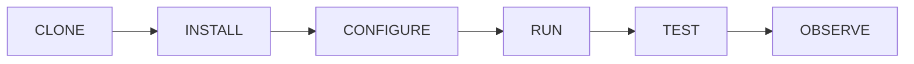

# P03 — eCDF

## eCDF PROTOTYPE BUILD PLAN v0.1
## eCDF REPOSITORY BOOTSTRAP v0.1

**Milestone:** P03-M01 — Whitepaper + Architecture v0.1  
**Cycle:** 4 — Build preparation  
**Date:** 2026-09-17  
**Target:** INC-01 — Repository Foundation  
**Rule:** BUILD ONLY WHAT THE PROTOTYPE REQUIRES  
**Evidence status:** candidate planning artifact only  

**Factual inspection:** the current workspace contains the Cycle 2 and Cycle 3 Markdown artifacts but is **not a Git repository**. No repository URL, branch, commit, license or historical code is verified here. A read-only attempt to resolve `https://github.com/Emeraude-Kiangana/ecdf.git` required authentication and did not establish existence or contents. Local runtime availability is **VERIFIED**: Node `v24.19.0`, npm `11.9.0`. Registry lookup on 2026-09-17 returned `@stellar/stellar-sdk` `17.1.0`, Zod `4.6.5`, Vitest `5.0.1`, TypeScript `7.0.2`, `@types/node` `22.20.3`, ESLint `10.10.0`, Prettier `3.9.7`. These are discovery results, not installed project dependencies.

---

# 1. BUILD READINESS GATE

## Pre-build validation

| Element | Status | Basis | Blocking INC-01? | Required action |
|---|---|---|---:|---|
| Core hypothesis | **READY** | Cycle 3 defines a falsifiable Stellar Classic Testnet hypothesis, success, failure and not-proven boundaries. | No | Preserve unchanged in README/spec. |
| Happy path | **READY** | Intent → validation → local signature → RPC submission → reconciliation → evidence. | No | Implement only from INC-02 onward. |
| State machine | **READY** | DRAFT, AUTHORIZED, SUBMITTED, SETTLED, REJECTED, FAILED, RECONCILIATION_REQUIRED. | No | Add tests in INC-02. |
| Actor model | **PARTIALLY READY** | Prototype operator is defined; no verified real user. | No for INC-01 | Keep synthetic/test actor; field research remains separate. |
| Stellar role | **READY for experiment** | Native XLM Testnet payment; no Soroban/SAC/asset issuance. | No | Pin SDK; live integration begins INC-03. |
| On-chain/off-chain split | **READY** | Only protocol-required payment data on-chain; secrets/PII/logs off-chain. | No | Encode safeguards and docs. |
| Signing model | **PARTIALLY READY** | Disposable Testnet key and local signing decided; exact local secret source still needs selection. | No for skeleton; Yes before INC-03 | Select protected file or environment-variable method before key use. |
| Minimal data model | **READY** | TransferIntent, OperationRecord, PreparedOperation, SubmissionReference, EvidenceManifest. | No | No database in INC-01. |
| Success criteria | **READY** | Terminal state, reconciliation, no leakage, reproducibility and centralized comparison. | No | Link from README. |
| Critical tests | **READY as specifications** | Cycle 3 defines TEST-eCDF-001 through TEST-eCDF-010. | No | INC-01 implements only bootstrap health tests. |

## BUILD READINESS GATE v0.1

| Area | Status | Blocking? | Required action |
|---|---|---:|---|
| Core hypothesis | **READY** | No | None for INC-01. |
| Architecture | **READY for bootstrap** | No | Place Cycle 3 spec under `docs/architecture/`. |
| Stellar integration | **PARTIALLY READY** | No for INC-01 | Record SDK `17.1.0` as proposed exact pin; verify import/API in INC-03 before live use. |
| Data model | **READY** | No | Preserve spec; implementation starts INC-02. |
| Signing | **PARTIALLY READY** | No for INC-01 | `.env.example` contains no secret; choose secret source before INC-03. |
| Tests | **READY for INC-01** | No | Bootstrap, structure, config and Mainnet-guard tests. |
| Security | **READY for INC-01** | No | `.env` ignored, no keys/PII, secret scan command, safe logging rule. |
| Repository plan | **BLOCKED** | **Yes** | Resolve whether to clone an existing repository or initialize a new local repository; verify URL/ownership. |
| License | **BLOCKED** | **Yes for first commit** | Owner explicitly chooses license. Apache-2.0 is proposed, not decided. |

## Gate decision

**STATUS: CONDITIONAL NO-GO.**

Architecture does not block INC-01. The only critical blockers are repository identity/location and owner-approved license. No source code or Git history should be created under an assumed remote. Once those two items are resolved, INC-01 can begin immediately from the atomic tasks below.

**Not blockers for INC-01:** real user validation, production custody, legal analysis, live Testnet account funding, RPC timeout measurements and asset-model research.

---

# 2. REPOSITORY IDENTITY

| Field | Value | Status |
|---|---|---|
| PROJECT NAME | `eCDF` | **DECIDED** |
| REPOSITORY NAME | `ecdf` | **PROPOSED** |
| REMOTE REPOSITORY | Unknown; historical claim `Emeraude-Kiangana/ecdf` not verified | **BLOCKED** |
| VERSION | `prototype-v0.1` document/milestone label | **DECIDED** |
| SOFTWARE VERSION | `0.1.0-alpha.0` after first working manifest | **PROPOSED** |
| LICENSE | Apache License 2.0 | **PROPOSED — OWNER APPROVAL REQUIRED** |
| PRIMARY LANGUAGE | TypeScript | **DECIDED for prototype plan** |
| RUNTIME | Node.js 24.x | **DECIDED baseline; local 24.19.0 verified** |
| PACKAGE MANAGER | npm 11.x with committed lockfile | **DECIDED baseline; local 11.9.0 verified** |
| TEST FRAMEWORK | Vitest 5.x | **DECIDED for plan; install/test required** |
| STELLAR SDK | `@stellar/stellar-sdk` exactly `17.1.0` | **PROPOSED exact pin; registry result verified** |
| TARGET NETWORK | Stellar Testnet only | **DECIDED** |
| USER INTERFACE | CLI | **DECIDED for v0.1** |
| DATA STORE | Versioned schemas + local JSON/JSONL runtime artifacts; no DB | **DECIDED** |

## License decision boundary

Apache-2.0 is proposed because it is permissive and includes an express patent license. This is not a legal conclusion. If the owner prefers MIT or wants to keep the repository private/unlicensed during research, the choice must be made before adding `LICENSE` to the first commit.

## Branching

- Default: `main`.
- Short-lived branches only when a change benefits from isolated review, such as `feat/state-machine`.
- No GitFlow, release branch or long-lived `develop` branch.
- Branch names and remote protections cannot be claimed until a real repository exists.

## Commit policy

Format: `type(scope): description`.

Allowed initial types: `docs`, `chore`, `test`, `feat`, `fix`, `refactor`. Each commit must correspond to an observable change and pass the tests appropriate to its increment. No historical commits are invented.

---

# 3. FINAL PROTOTYPE STACK

| Layer | Final candidate | Why required | Status |
|---|---|---|---|
| Runtime | Node.js 24.x | Verified local runtime; current LTS-class environment for TypeScript CLI | **DECIDED baseline** |
| Language | TypeScript 7.0.2 | Types for state transitions, adapters and evidence schemas | **PROPOSED exact pin** |
| Package manager | npm 11.x | Already available; lockfile supports reproducibility | **DECIDED baseline** |
| CLI | Native Node argument handling initially | Avoid unnecessary CLI framework | **DECIDED** |
| Validation | Zod 4.6.5 | Runtime validation of untrusted config/intent | **PROPOSED exact pin; INC-02 dependency** |
| Test runner | Vitest 5.0.1 | Fast unit/integration runner with TypeScript support | **PROPOSED exact pin** |
| Stellar client | `@stellar/stellar-sdk` 17.1.0 | Build/sign native payment and use RPC | **PROPOSED exact pin; INC-03 dependency** |
| Persistence | Node filesystem, JSON and JSONL | Sufficient for bounded local evidence; transparent | **DECIDED** |
| Database | None | No multi-user query or transactional DB requirement | **DECIDED NOT NEEDED** |
| Lint | ESLint 10.10.0 | Static quality gate if configuration remains minimal | **PROPOSED** |
| Formatting | Prettier 3.9.7 | Stable formatting, low operational complexity | **PROPOSED** |
| CI | GitHub Actions | Run deterministic local checks after repository exists | **PROPOSED** |
| Containers | None for INC-01 | Node environment is sufficient; avoid premature Docker | **DEFERRED** |
| Secret scan | Gitleaks in CI/local if available | Detect accidental key/credential commits | **PROPOSED; installation route to verify** |

**Explicit exclusions:** backend framework, frontend framework, database ORM, Docker runtime, Kubernetes, queues, microservices, AI agents, smart contracts and deployment platform.

---

# 4. REPOSITORY TREE

```text
ecdf/
├── .github/
│   └── workflows/
│       └── verify.yml
├── docs/
│   ├── foundation/
│   │   └── README.md
│   ├── research/
│   │   └── ecdf-research-matrix-adr-v0.1.md
│   ├── architecture/
│   │   └── ecdf-architecture-prototype-spec-v0.1.md
│   ├── adr/
│   │   └── README.md
│   └── prototype/
│       ├── build-plan-v0.1.md
│       └── BUILD_LOG.md
├── src/
│   └── index.ts
├── tests/
│   └── bootstrap.test.ts
├── .env.example
├── .gitignore
├── LICENSE
├── README.md
├── SECURITY.md
├── package.json
├── package-lock.json
├── tsconfig.json
├── eslint.config.js
└── prettier.config.js
```

## Scope discipline

- `src/index.ts` may contain only a harmless bootstrap/version command in INC-01—no domain or network logic.
- `tests/bootstrap.test.ts` verifies environment and configuration invariants.
- No empty folders are created merely to mirror future architecture.
- `src/domain`, `src/adapters`, `tests/integration`, `tests/e2e`, `scripts` and `artifacts` appear only when their increments require them.
- `LICENSE` is created only after owner approval.

## Documentation source of truth

- `docs/foundation/` — problem/scope foundation artifacts.
- `docs/research/` — research matrix, sources and technical capability findings.
- `docs/architecture/` — current technical architecture and prototype specification.
- `docs/adr/` — accepted/rejected/deferred architecture decisions.
- `docs/prototype/` — build plan, setup/test protocol and build log.
- README is the entry point, not the sole technical truth.
- Whitepaper will synthesize these sources; it will not replace them.

---

# 5. DEPENDENCY REGISTER

## INC-01 dependencies

| Dependency | Purpose | Required? | Alternative | Risk/control |
|---|---|---:|---|---|
| `typescript@7.0.2` | Compile/type-check TypeScript | Yes | JavaScript with JSDoc | New major version; pin exactly and test locally |
| `vitest@5.0.1` | Execute bootstrap/unit tests | Yes | Node built-in test runner | Additional dependency; pin and lock |
| `@types/node@22.20.3` | Node API types | Yes for TypeScript setup | Use Node-shipped types if supported later | Version differs from Node 24 runtime; verify type compatibility before commit |
| `eslint@10.10.0` | Minimal static checks | Conditionally yes | TypeScript compiler only | Config overhead; remove if incompatible/no useful rule |
| `prettier@3.9.7` | Deterministic formatting | Conditionally yes | Manual formatting | Low risk; pin exactly |

## Later-increment dependencies

| Dependency | Purpose | Required? | Alternative | Risk/control |
|---|---|---:|---|---|
| `zod@4.6.5` | Runtime schema validation | Yes from INC-02 | Hand-written guards/Ajv | Adds runtime surface; use only at untrusted boundaries |
| `@stellar/stellar-sdk@17.1.0` | Stellar transaction/signature/RPC integration | Yes from INC-03 | Stellar CLI subprocess or Rust SDK | Network/protocol API change; exact pin, official docs, adapter isolation |

## Policy

1. Exact versions in `package.json`; lockfile committed.
2. A dependency must support a named requirement or test.
3. No production dependency for formatting, linting or test-only work.
4. Review license, repository provenance and audit output before first commit.
5. No automatic dependency updates in INC-01.
6. Adding a dependency requires recording purpose, alternatives and risk here or in an ADR.

**Open compatibility check:** `@types/node` latest registry version is 22.20.3 while the local runtime is Node 24.19.0. INC-01 must verify whether the runtime/toolchain supplies a more appropriate Node 24 type package or whether `22.20.3` is compatible. This is a task, not a hidden assumption.

---

# 6. CONFIGURATION MODEL

## `.env.example`

```dotenv
# Runtime
NODE_ENV=development
LOG_LEVEL=info

# Safety: prototype accepts testnet only
STELLAR_NETWORK=testnet
STELLAR_RPC_URL=https://REPLACE_WITH_TESTNET_RPC_ENDPOINT

# Disposable Testnet signing only.
# Do not place a real key here and never commit .env.
STELLAR_SECRET_KEY=REPLACE_WITH_DISPOSABLE_TESTNET_SECRET_AT_RUNTIME

# Prototype safety limit in XLM test value; final value set before INC-03.
MAX_TEST_AMOUNT_XLM=REPLACE_BEFORE_LIVE_TEST

# Local evidence output; no database is used.
EVIDENCE_DIR=./artifacts/runs
```

## Configuration rules

- `.env.example` contains placeholders only.
- `.env`, `.env.*` are ignored except `.env.example`.
- Mainnet passphrase/network or non-Testnet RPC configuration causes immediate failure.
- The signing secret is loaded only inside the local signer in INC-03.
- No `DATABASE_URL`; the prototype has no database.
- No RPC token or credential is required for INC-01.
- Logs must never print full environment variables.
- A startup config validator will be introduced before network integration.

## `.gitignore` minimum

```gitignore
node_modules/
dist/
coverage/
artifacts/runs/
.env
.env.*
!.env.example
*.log
```

## Placeholder semantics

The example RPC URL is intentionally nonfunctional until a current Testnet endpoint is selected. The sample secret is deliberately invalid. INC-01 tests must assert that example placeholders are rejected by any command that would access the network.

---

# 7. INC-01 SPECIFICATION

## INC-01 — Repository Foundation

**OBJECTIVE:** Create a clean, minimal and reproducible repository foundation without implementing business or Stellar logic.

**ENTRY CONDITIONS:**

- repository identity/location resolved;
- owner-approved license selected;
- TypeScript/Node/npm/Vitest stack accepted;
- existing repository contents inspected if a repository exists;
- Cycle 2–4 documents available for placement.

**INPUT:** Cycle 2 Research/ADR artifact, Cycle 3 Architecture/Prototype artifact, this Build Plan, verified local runtime and resolved repository decision.

**OUTPUT:**

- Git repository on `main` or verified existing branch;
- minimal tree from section 4;
- exact dependency manifest and lockfile;
- TypeScript configuration;
- initial README, `.gitignore`, `.env.example`, SECURITY policy and license;
- bootstrap command and health tests;
- minimal CI workflow;
- Build Log entry;
- clean secret scan and test results.

**NON-OUTPUT:** no TransferIntent, state machine, Stellar call, key generation, Testnet transaction, HTTP API, database or deployment.

## Initial README v0.1 content

```markdown
# eCDF

## Status

Prototype / Research — pre-production, test environment only.

## Purpose

eCDF is a technology research prototype for testing whether an explicitly
authorized test-value transfer can produce a verifiable and reproducible
result through a minimal settlement adapter.

## Scope

The prototype compares the same canonical transfer intent through a local
centralized baseline and a minimal Stellar Classic Testnet path.

## Non-goals

No real funds, CDF backing, redemption, Mainnet, production custody, banking,
mobile-money integration, KYC system, smart contract, token sale or legal claim.

## Architecture

See `docs/architecture/ecdf-architecture-prototype-spec-v0.1.md`.

## Requirements

- Node.js 24.x
- npm 11.x

## Setup

Copy `.env.example` to `.env` only when configuration is required. Never place
real credentials or value-bearing keys in this repository.

    npm ci

## Run

    npm run health

## Test

    npm test
    npm run typecheck
    npm run lint

## Evidence

Bootstrap checks report runtime, project version and safe configuration status.
Future experiment artifacts will be written under ignored local run directories
and reviewed before any publication.

## Limitations

The prototype has not established a validated user problem, legal
permissibility, production security, scalability or blockchain necessity.

## Disclaimer

This repository is a technology prototype and research artifact. It is not an
official currency, CBDC, bank, payment service, investment product or claim on
Congolese francs. Testnet assets have no represented monetary value.
```

## Build Log template

```markdown
# BUILD LOG

## Session YYYY-MM-DD

**DATE:**  
**INCREMENT:** INC-01  
**TASKS:**  
**FILES CHANGED:**  
**TESTS RUN:**  
**RESULT:** PASS / FAIL / BLOCKED  
**BLOCKERS:**  
**NEXT:**
```

## DONE WHEN

1. clean `npm ci` succeeds;
2. `npm run health` exits 0 and reports only safe metadata;
3. `npm test`, `npm run typecheck`, `npm run lint` and formatting check pass;
4. `.env` and secret-like test fixtures cannot enter tracked files;
5. README commands work from the repository root;
6. CI runs the same deterministic commands;
7. `git status` is clean after install/test except intentionally ignored outputs;
8. Build Log records actual files/tests/results;
9. no Stellar network call occurs.

---

# 8. INC-01 TASKS

## TASK-eCDF-001 — Resolve repository target

**DESCRIPTION:** Determine whether to clone a verified existing repository or initialize a new `ecdf` repository.  
**INPUT:** Owner confirmation and/or authenticated repository metadata.  
**OUTPUT:** Verified local repository path, remote URL if any, default branch and baseline commit state.  
**COMMAND:** `git remote -v`, `git branch --show-current`, `git rev-parse HEAD` after resolution.  
**TEST:** Commands return coherent values; existing files are inventoried before modification.  
**DONE WHEN:** Repository identity is factual, not inferred.  
**EVIDENCE:** Baseline record with URL/path/branch/commit and redacted status.

## TASK-eCDF-002 — Decide license

**DESCRIPTION:** Obtain explicit owner choice: Apache-2.0 proposed, MIT alternative, or no public license yet.  
**INPUT:** Owner decision.  
**OUTPUT:** Exact LICENSE content or documented deferral that blocks public first commit.  
**COMMAND:** None until decision.  
**TEST:** SPDX identifier matches chosen text/package metadata.  
**DONE WHEN:** License is explicit and consistent.  
**EVIDENCE:** Decision note/ADR update.

## TASK-eCDF-003 — Create minimal directories and documentation placement

**DESCRIPTION:** Create only directories/files in the approved INC-01 tree and copy existing artifacts without rewriting their claims.  
**INPUT:** Cycle 2–4 Markdown artifacts.  
**OUTPUT:** `docs/` hierarchy, README, Build Log and placeholder ADR index.  
**COMMAND:** Use controlled file creation; no generated application framework.  
**TEST:** Tree matches section 4; all referenced links resolve.  
**DONE WHEN:** No empty speculative architecture directories exist.  
**EVIDENCE:** Sorted file inventory and link check.

## TASK-eCDF-004 — Initialize npm manifest

**DESCRIPTION:** Create private prerelease package metadata and deterministic scripts.  
**INPUT:** Repository identity, license and stack decision.  
**OUTPUT:** `package.json` with `private: true`, version `0.1.0-alpha.0`, engines and scripts.  
**COMMAND:** `npm init` followed by reviewed manifest edits; no publish configuration.  
**TEST:** `npm pkg get name version private engines scripts`.  
**DONE WHEN:** Manifest contains no publish/release automation and matches identity.  
**EVIDENCE:** Manifest diff.

## TASK-eCDF-005 — Install only INC-01 development dependencies

**DESCRIPTION:** Pin TypeScript, Vitest, Node types, ESLint and Prettier after compatibility check.  
**INPUT:** Exact dependency register.  
**OUTPUT:** `package-lock.json` and reviewed audit output.  
**COMMAND:** Exact-version npm install commands determined at execution.  
**TEST:** `npm ci` succeeds from clean `node_modules`.  
**DONE WHEN:** Lockfile is generated and no unreviewed dependency is added.  
**EVIDENCE:** Lockfile hash, `npm ls --depth=0`, audit summary.

## TASK-eCDF-006 — Configure TypeScript and quality scripts

**DESCRIPTION:** Add strict TypeScript configuration plus minimal lint/format rules.  
**INPUT:** Installed tool versions.  
**OUTPUT:** `tsconfig.json`, ESLint and Prettier configuration.  
**COMMAND:** `npm run typecheck`, `npm run lint`, `npm run format:check`.  
**TEST:** All commands exit 0 on skeleton.  
**DONE WHEN:** Config is small, documented and does not require framework plugins.  
**EVIDENCE:** Command outputs.

## TASK-eCDF-007 — Add safe configuration files

**DESCRIPTION:** Add `.env.example` and `.gitignore`; verify placeholders and ignore behavior.  
**INPUT:** Configuration model.  
**OUTPUT:** Safe config template and ignore rules.  
**COMMAND:** `git check-ignore .env artifacts/runs/example/result.json`.  
**TEST:** `.env` and run artifacts are ignored while `.env.example` remains trackable.  
**DONE WHEN:** No valid secret/value appears anywhere.  
**EVIDENCE:** Ignore test output and secret scan.

## TASK-eCDF-008 — Add bootstrap health command

**DESCRIPTION:** Implement only a harmless command returning project version, runtime compatibility and safe network/config status.  
**INPUT:** Package/config metadata.  
**OUTPUT:** `src/index.ts` and `npm run health`.  
**COMMAND:** `npm run health`.  
**TEST:** TEST-eCDF-001 and Mainnet/placeholder safety cases.  
**DONE WHEN:** Command exits deterministically and performs no network call.  
**EVIDENCE:** Captured safe output and test report.

## TASK-eCDF-009 — Add initial tests

**DESCRIPTION:** Create bootstrap, structure, config-safety and state-contract placeholder tests without implementing domain logic.  
**INPUT:** Initial test specifications.  
**OUTPUT:** `tests/bootstrap.test.ts`.  
**COMMAND:** `npm test`.  
**TEST:** All implemented INC-01 tests pass; future state tests may be marked specification-only, not skipped green tests.  
**DONE WHEN:** At least one real test executes and exit status is verified.  
**EVIDENCE:** Test report with count and duration.

## TASK-eCDF-010 — Add minimal CI

**DESCRIPTION:** Create one workflow mirroring local install/typecheck/lint/test/format/secret checks.  
**INPUT:** Working local commands.  
**OUTPUT:** `.github/workflows/verify.yml`.  
**COMMAND:** Push/PR after repository remote exists.  
**TEST:** Workflow syntax and first actual run pass.  
**DONE WHEN:** CI contains no deployment, release or live Testnet step.  
**EVIDENCE:** Workflow run URL only after it exists; never invented.

## TASK-eCDF-011 — Add SECURITY baseline

**DESCRIPTION:** Document supported prototype status, safe reporting, prohibited secrets/real funds and key-compromise response.  
**INPUT:** Cycle 3 security controls.  
**OUTPUT:** `SECURITY.md`.  
**COMMAND:** None.  
**TEST:** Documentation review and link check.  
**DONE WHEN:** It contains no claim of audit or production security.  
**EVIDENCE:** Reviewed file diff.

## TASK-eCDF-012 — Execute readiness verification and prepare first commit

**DESCRIPTION:** Run every local gate, inspect tracked files and stage only approved content.  
**INPUT:** Completed tasks 001–011.  
**OUTPUT:** Clean staged diff and Build Log session.  
**COMMAND:** `npm ci`, checks, `git status --short`, tracked-file secret scan.  
**TEST:** All commands pass; no generated/secret files staged.  
**DONE WHEN:** First commit content exactly matches section 12.  
**EVIDENCE:** Command transcript, file list, checksums and actual commit hash only after commit.

---

# 9. INITIAL TESTS

## TEST-eCDF-001 — Project bootstrap health

**HYPOTHESIS:** A clean clone/install can execute the harmless health command and real test runner without network access.  
**SETUP:** Supported Node/npm; no `.env`; dependencies installed from lockfile.  
**ACTION:** Run `npm ci`, `npm run health`, `npm test`.  
**EXPECTED:** Exit 0; project/runtime/version shown; network status `not configured`; at least one test executed.  
**FAILURE:** Install drift, crash, network call, placeholder treated as valid, or zero executed tests.  
**ARTIFACT:** Command transcript, test report, lockfile checksum.

## TEST-eCDF-002 — Core state transition specification

**HYPOTHESIS:** `DRAFT → AUTHORIZED` is an allowed transition only when authorization evidence is valid.  
**SETUP:** State transition contract fixture.  
**ACTION:** Evaluate allowed transition.  
**EXPECTED:** Transition accepted with event metadata.  
**FAILURE:** Valid transition rejected or state mutates without evidence.  
**ARTIFACT:** Unit test report.  
**IMPLEMENTATION:** **INC-02 — specified now, not falsely executed in INC-01**.

## TEST-eCDF-003 — Invalid state transition rejected

**HYPOTHESIS:** `DRAFT → SETTLED` and `FAILED → SETTLED` are rejected.  
**SETUP:** Invalid transition fixtures.  
**ACTION:** Attempt transitions.  
**EXPECTED:** Stable domain error; original state unchanged.  
**FAILURE:** Transition succeeds or mutates history.  
**ARTIFACT:** Unit test report.  
**IMPLEMENTATION:** **INC-02 — specified now**.

## TEST-eCDF-004 — Testnet-only configuration

**HYPOTHESIS:** Mainnet or unknown network configuration fails before signer/network initialization.  
**SETUP:** Testnet, Mainnet and invalid config fixtures.  
**ACTION:** Validate startup config.  
**EXPECTED:** Testnet accepted; others rejected.  
**FAILURE:** Mainnet accepted or secret loaded first.  
**ARTIFACT:** Bootstrap test report.

## TEST-eCDF-005 — Placeholder and secret safety

**HYPOTHESIS:** `.env.example` contains no valid secret and placeholder config cannot initiate an operation.  
**SETUP:** Repository files plus canary secret fixture created only in ignored temp path.  
**ACTION:** Run config validation and secret scan.  
**EXPECTED:** Placeholder rejected; tracked tree scan clean.  
**FAILURE:** Placeholder accepted or canary/tracked credential found.  
**ARTIFACT:** Sanitized scan result.

## Mock / real network strategy

- **UNIT:** no real network; pure fixtures and fake adapters.
- **INTEGRATION:** fake/in-memory RPC gateway first; controlled Testnet integration only from INC-03.
- **E2E:** real Stellar Testnet only for the final core experiment, opt-in and never part of every local unit run.
- **CI:** no live Testnet dependency in the initial workflow.

## Stellar adapter boundary

```text
DOMAIN
  ↓ canonical intent / domain result
SETTLEMENT PORT
  ↓ provider-neutral prepared/submission/reconciliation types
STELLAR CLASSIC ADAPTER
  ↓ SDK-specific transaction/XDR/RPC
STELLAR SDK + RPC + TESTNET
```

No domain module may import the Stellar SDK. SDK types stop at the adapter boundary. Network behavior is mocked through the settlement port.

---

# 10. CI PLAN

## Trigger

- push to `main`;
- pull request targeting `main`;
- manual dispatch optional.

## Single initial job

`checkout → setup supported Node → npm ci → typecheck → lint → format check → unit/bootstrap tests → secret scan`

## Required properties

- lockfile cache only if it does not obscure clean-install behavior;
- no environment secret;
- no RPC call;
- no Testnet funding;
- no build/publish/deploy/release job;
- no badge until a real workflow exists and runs;
- workflow versions pinned to reviewed major actions;
- failure of any check blocks merge by policy only after repository settings are verified.

## Initial scripts contract

| Script | Purpose | Network? |
|---|---|---:|
| `npm run health` | Safe project/runtime/config health | No |
| `npm run typecheck` | TypeScript no-emit check | No |
| `npm run lint` | Static lint | No |
| `npm run format:check` | Formatting verification | No |
| `npm test` | Real INC-01 tests | No |
| `npm run verify` | Run all deterministic local gates | No |

Live integration will later use a distinct explicit command such as `npm run test:integration:stellar`, never hidden inside `npm test`.

---

# 11. SECURITY BASELINE

## Pre-commit checklist

- [ ] No secret key, seed, mnemonic or private key.
- [ ] No real RPC credential, token, password or authorization header.
- [ ] No real user name, phone, email, national ID, KYC or financial history.
- [ ] `.env` and generated artifacts ignored.
- [ ] `.env.example` contains invalid placeholders only.
- [ ] Logs use an allowlist and never dump `process.env`.
- [ ] Package scripts contain no credential or remote deployment action.
- [ ] Dependencies match the register and lockfile.
- [ ] `npm audit` output reviewed without claiming zero risk.
- [ ] Mainnet configuration rejected by test.
- [ ] Secret scan executed against tracked/staged content.
- [ ] Documentation states Testnet/no-value limitations.

## SECURITY.md minimum

- status: experimental research prototype;
- no production/security warranty claim;
- no real funds or value-bearing keys;
- report vulnerabilities privately through a verified channel once repository hosting exists;
- rotate/discard any exposed disposable Testnet key;
- never attach secrets to issues, logs or evidence packages;
- supported version initially limited to current `main` prototype state.

## Before production

Production custody, authentication, secure keystore, recovery, rate limiting, deployment hardening, monitoring, backup, privacy review, legal review, penetration testing and external security review remain **DEFERRED**. They are not implied by INC-01.

---

# 12. FIRST COMMIT CONTENT

## Target commit

**Proposed message:** `chore(repo): bootstrap eCDF prototype foundation`

## Included

- approved repository skeleton;
- `README.md` v0.1;
- `.gitignore`;
- `.env.example` with placeholders;
- owner-approved `LICENSE`;
- `SECURITY.md`;
- `package.json` and `package-lock.json`;
- TypeScript, test, lint and formatting configurations;
- harmless `src/index.ts` health command;
- real `tests/bootstrap.test.ts`;
- minimal `.github/workflows/verify.yml` only after local checks work;
- Cycle 2 research/ADR artifact;
- Cycle 3 architecture/prototype artifact;
- Cycle 4 build plan and Build Log template.

## Excluded

- keys/secrets/`.env`;
- `node_modules`, build output, coverage, logs and run artifacts;
- domain/state implementation;
- Stellar SDK and Zod if not yet required by executed INC-01 code;
- any RPC endpoint credential;
- live transaction, asset or Testnet account;
- deployment/release configuration;
- fabricated badge, commit hash, test count or evidence ID.

## Commit gate

The commit is permitted only after local `verify`, secret scan, staged-file review and Build Log completion. Its hash must be reported only after Git creates it.

---

# 13. REPRODUCIBILITY CONTRACT



| Stage | Contract for INC-01 | Proof |
|---|---|---|
| CLONE | Obtain verified repository and checkout recorded commit/branch | Remote/path + commit recorded |
| INSTALL | Supported Node/npm; `npm ci` from committed lockfile | Exit code and lockfile hash |
| CONFIGURE | No config needed for health; `.env.example` placeholders documented | Config safety tests |
| RUN | `npm run health` performs no network operation and reveals no secret | Captured safe output |
| TEST | `npm run verify` executes deterministic checks | Test/check report |
| OBSERVE | Build Log lists environment, files, commands, results and blockers | Completed Build Log entry |

## Progressive contract after INC-01

- INC-02 adds local state-machine reproduction.
- INC-03 adds explicit opt-in Testnet setup and transaction observation.
- INC-04 adds end-to-end reconciliation.
- INC-05 adds clean-environment reproduction by another person.

The README must never advertise a step that has not been executed successfully at least once in the actual repository.

---

# 14. EVIDENCE TARGET

## Candidate claim

> The eCDF prototype repository has a versioned initial structure and a functioning minimal test environment.

## Promotion conditions

| Level | Condition | Current status |
|---|---|---|
| L0 — CLAIM | Plan states what INC-01 should produce | **CURRENT** |
| L1 — ARTIFACT | Repository/files actually exist and are registered | **NOT YET** |
| L2 — TESTED | Bootstrap tests and clean install are actually executed with retained artifacts | **NOT YET** |
| L3 — REPRODUCIBLE | Independent clean-environment rerun succeeds | **NOT YET** |
| L4 — PUBLIC | Verified public repository/release is accessible | **NOT YET** |
| L5 — EXTERNALLY VALIDATED | Independent third party validates the claim | **NOT YET** |

## INC-01 evidence package candidate

- repository URL/path, branch and commit hash;
- sorted tracked-file manifest;
- runtime/npm versions;
- package-lock checksum;
- `npm ci` transcript/exit result;
- test/typecheck/lint/format results;
- secret-scan result;
- CI run URL if it actually exists;
- completed Build Log;
- limitations statement.

No Evidence ID or evidence level is assigned in this document. Registration belongs to the Evidence Registry Master.

---

# 15. ONE NEXT ACTION

## NEXT → Resolve the Repository Foundation Gate

Provide or verify the repository through one of these mutually exclusive paths:

1. **Existing repository:** attach/select the repository or provide authenticated access to the exact `Emeraude-Kiangana/ecdf` remote so its branch, commit, files and license can be inspected before modification.
2. **New repository:** explicitly authorize creation of a new local `ecdf` repository with `main` and choose the license: **Apache-2.0 (proposed)**, MIT, or no public license yet.

Once the path and license are explicit, launch **TASK-eCDF-001 → TASK-eCDF-012** in order. The first executable checkpoint is:

> Verified repository + approved license + `npm ci` + one real bootstrap test + clean security checks.

**Current operational status:** Cycle 4 specification is complete, but INC-01 remains **BLOCKED** by repository identity and license ownership decisions. No code or Git history has been created, consistent with the instruction not to generate the full project yet.
