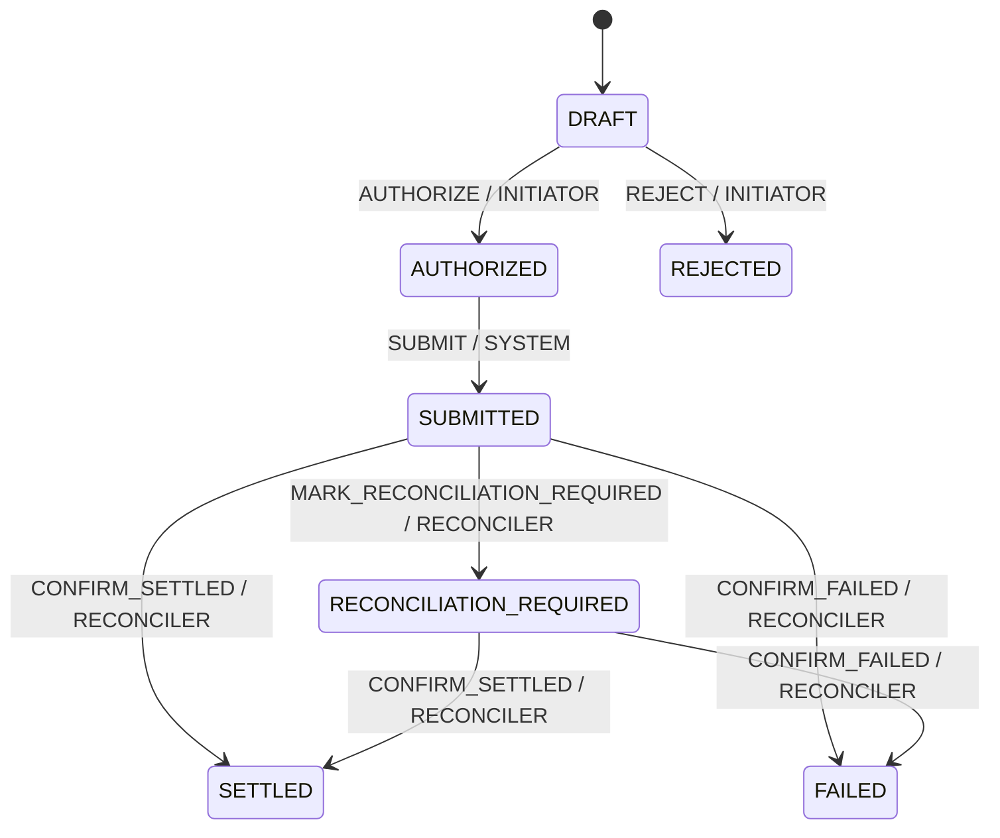

# Core Domain Model v0.1

**Project:** P03 — eCDF  
**Increment:** INC-02 — Core Domain + State Machine  
**Date:** 2026-09-17  
**Status:** IMPLEMENTED AND TESTED LOCALLY

## Boundary

The core domain models one synthetic test-value transfer. It owns identifiers,
participants, an exact positive amount, operation state, transition rules,
authorization roles and processed event identifiers.

It does not import or call Stellar, RPC, HTTP, a database, a wallet, the
filesystem, a UI, system time or randomness. Infrastructure will translate its
results at a later boundary.

## Entity and value objects

`TransferOperation` is the single aggregate root. It starts in `DRAFT`; every
accepted event returns a new immutable operation. Previous instances remain
unchanged.

| Value object | Rule |
|---|---|
| `OperationId` | 1–64 safe identifier characters |
| `EventId` | 1–64 safe identifier characters |
| `ActorId` | 1–64 safe identifier characters |
| `TestAmount` | Positive base-10 integer stored as `bigint` |

Source and destination must differ. No floating-point amount enters the domain.
Asset identity and decimal conversion remain outside INC-02.

## State machine

`SETTLED`, `REJECTED` and `FAILED` are terminal. `SUBMIT` records only a domain
event; it performs no network request.

## Invariants

| ID | Invariant | Test |
|---|---|---|
| INV-001 | Source and destination differ | TEST-eCDF-004 |
| INV-002 | Amount is an exact positive integer in atomic units | TEST-eCDF-004 |
| INV-003 | Only listed state/event pairs are accepted | TEST-eCDF-002/003 |
| INV-004 | Only the required role may apply a valid event | TEST-eCDF-003 |
| INV-005 | Terminal states cannot transition | TEST-eCDF-003 |
| INV-006 | An event identifier is applied at most once per operation | TEST-eCDF-005 |
| INV-007 | Applying an event never mutates a prior operation | TEST-eCDF-002/003/005 |
| INV-008 | Equal inputs and event sequences produce equal snapshots | TEST-eCDF-004 |

## Error model

Known failures extend `DomainError` with a stable code:

- `InvalidIdentifierError` — `INVALID_IDENTIFIER`;
- `InvalidAmountError` — `INVALID_AMOUNT`;
- `InvalidOperationParticipantsError` — `INVALID_OPERATION_PARTICIPANTS`;
- `InvalidTransitionError` — `INVALID_TRANSITION`;
- `UnauthorizedDomainActionError` — `UNAUTHORIZED_DOMAIN_ACTION`;
- `DuplicateDomainEventError` — `DUPLICATE_DOMAIN_EVENT`.

## Known limits

- Roles are domain authorization, not real authentication.
- Event IDs prevent replay only inside one aggregate instance. Persistent
  cross-process idempotency belongs to later infrastructure.
- `SETTLED` must later be emitted only from verifiable adapter evidence.
- Maximum amount, asset scale, balances and supply are not defined.
- Production concurrency and persistence are not proven.
